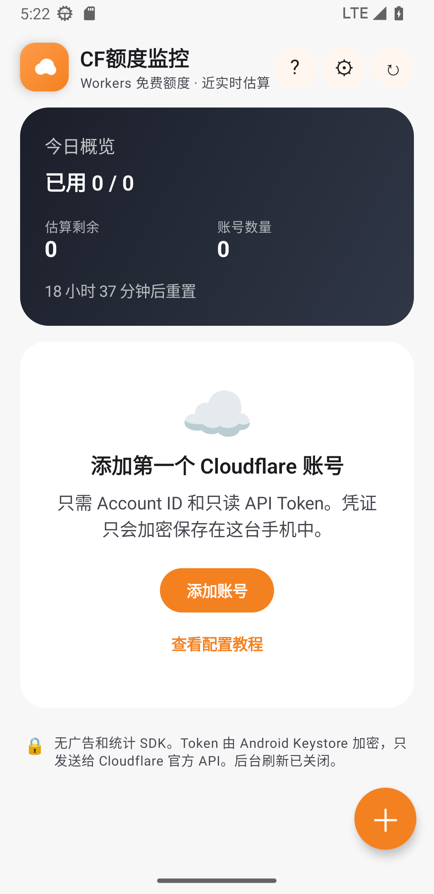

<p align="center"></p>

<p align="center">
  <strong>简体中文</strong> · <a href="README_EN.md">English</a> · <a href="README_RU.md">Русский</a> · <a href="README_IT.md">Italiano</a> · <a href="README_FR.md">Français</a> · <a href="README_ES.md">Español</a> · <a href="README_AR.md">العربية</a>
</p>

<p align="center">
  <a href="../../releases/latest"></a>
  
  
  <a href="LICENSE"></a>
</p>

<p align="center"><strong>美观、安全、纯本地的 Cloudflare Workers 多账号额度监控工具。</strong></p>

## 选择你的版本

| 设备 | 推荐下载 | 说明 |
|---|---|---|
| 普通Windows电脑（Intel/AMD） | `CF-Quota-Monitor-v1.0.0-Windows-x64-Setup.exe` | Windows 10/11，绝大多数电脑选择这个 |
| Windows ARM电脑（骁龙） | `CF-Quota-Monitor-v1.0.0-Windows-arm64-Setup.exe` | 仅适用于ARM64电脑 |
| 不想安装 | 对应架构的 `Portable.zip` | 解压后运行 `CFQuotaMonitor.exe` |
| Android手机 | `CF-Quota-Monitor-v1.2.0.apk` | Android 8.0及以上 |

不知道电脑架构时，打开 **设置 → 系统 → 系统信息 → 系统类型**。看到“基于x64的处理器”就下载x64版。

> Windows安装包目前未进行可信代码签名，SmartScreen可能显示“未知发布者”。源代码、自动构建脚本和SHA-256校验值均公开；开源签名正在准备申请。

## 平台功能

| 功能 | Android v1.2 | Windows v1.0 |
|---|:---:|:---:|
| 多账号同屏与进度条 | ✓ | ✓ |
| 打开时立即刷新 | ✓ | ✓ |
| 自选后台刷新频率 | ✓ | ✓（托盘运行） |
| 可选应用锁 | 指纹/面容/设备密码 | Windows Hello/备用PIN |
| 七种语言与阿拉伯语RTL | ✓ | ✓ |
| 本机加密Token | Android Keystore + AES-GCM | Windows DPAPI |
| 加密账户导入/导出 `.cfqm` | 后续版本 | ✓ |
| 开机启动、系统托盘 | — | ✓ |

Windows版支持中文、英语、俄语、意大利语、法语、西班牙语和阿拉伯语，首次启动跟随系统语言。窗口关闭后可留在系统托盘刷新；电脑休眠或完全退出时不会刷新。

## Android v1.2界面

<p align="center">
  
  &nbsp;&nbsp;
  
</p>

## 3分钟配置

1. 登录 [Cloudflare Dashboard](https://dash.cloudflare.com)，在 **Workers & Pages** 找到32位 **Account ID**。
2. 打开 **个人资料 → API Tokens → Create Custom Token**。
3. 只授予 `Account → Account Analytics → Read`，并限制为需要监控的账户。
4. 在应用中点击 **添加账户**，粘贴 Account ID 和 API Token。

不要使用 Global API Key，也不要把Token发到聊天、Issue或提交到GitHub。详细步骤见 [零基础配置教程](docs/安装与配置教程.md) 和 [Windows安装与使用教程](docs/Windows安装与使用.md)。

## 加密账户迁移

Windows版可以选择已保存账户并导出为`.cfqm`文件：

- API Token使用用户设置的备份密码加密，不生成明文凭据文件
- 文件使用PBKDF2-HMAC-SHA256派生密钥与AES-256-GCM认证加密
- 导入前显示账户预览，可选择跳过、替换或同时保留重复账户
- 不导出用量缓存、应用锁PIN、开机启动等设备专属设置

备份密码无法找回。格式说明见 [CFQM备份格式](docs/CFQM_BACKUP_FORMAT.md)。Android和其他平台将在后续版本按同一格式接入。

## 安全与隐私

```text
应用 ── HTTPS ──> Cloudflare官方GraphQL API
 │
 ├── Android Token：Android Keystore保护
 └── Windows Token：当前Windows用户DPAPI保护
```

- 无广告、无统计SDK、无崩溃上报SDK、无自建服务器
- Account ID、Token和用量缓存只保存在用户设备中
- Token只在查询时发送到`api.cloudflare.com`
- Windows开机启动只写入当前用户注册表，不需要管理员权限
- 删除账户时同步删除本地加密Token和缓存

完整说明见 [PRIVACY.md](PRIVACY.md) 和 [SECURITY.md](SECURITY.md)。

## 本地构建

Android需要JDK 17和Android SDK 35：

```powershell
.\gradlew.bat assembleDebug
```

Windows需要.NET 6 SDK。构建x64和ARM64安装包：

```powershell
.\build-windows.ps1 -Architecture all
```

脚本生成安装版、便携版和`SHA256SUMS-Windows.txt`。详细说明见 [Windows教程](docs/Windows安装与使用.md)。

## 说明与许可

Cloudflare Analytics可能延迟数分钟，也不是官方计费计数器；临近100%时请预留余量。

本项目使用 [MIT License](LICENSE)，与Cloudflare, Inc.无隶属或官方合作关系。
