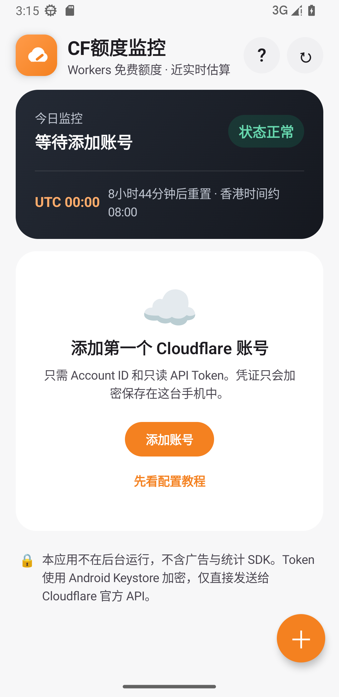

<p align="center">
  
</p>

<p align="center">
  <a href="../../releases/latest"></a>
  
  <a href="LICENSE"></a>
</p>

<p align="center">
  一个简洁、安全、纯本地的 Cloudflare Workers 免费额度查看工具。<br>
  多账号同屏展示，打开即刷新，不在后台运行。
</p>

---

## 一眼看懂用量

<p align="center">
  
</p>

| 多账号同屏 | 近实时估算 | 本地加密 | 无后台活动 |
|:---:|:---:|:---:|:---:|
| 每个账号独立进度条 | 已用、剩余、重置倒计时 | Android Keystore 加密 Token | 只在打开或手动刷新时联网 |

## 下载

前往 [Releases](../../releases/latest) 下载最新版：

```text
CF额度监控-v1.0.0.apk
```

支持 Android 8.0 及以上。APK 使用项目专属密钥签名，可覆盖安装后续版本。

## 3 分钟完成配置

### 1. 找到 Account ID

登录 [Cloudflare Dashboard](https://dash.cloudflare.com)，选择账号并打开 **Workers & Pages**，复制页面中的 **Account ID**。

### 2. 创建只读 Token

打开 **个人资料 → API Tokens → Create Custom Token**，只添加一项权限：

```text
Account → Account Analytics → Read
```

资源范围只选择需要监控的账号。不要使用 Global API Key。

### 3. 添加到 App

打开 App，点击右下角 **＋**，填写账号备注、Account ID 和 API Token，然后点击 **保存并查询**。

> Token 通常只完整显示一次。请勿把 Token 发到聊天、Issue 或提交到 GitHub。

更详细的说明见 [零基础安装与配置教程](docs/安装与配置教程.md)，App 右上角的 `?` 也内置了同样的教程。

## 功能

- 多个 Cloudflare 账号在同一页面展示
- 今日已用量、估算剩余量、使用百分比和进度条
- UTC 00:00 日切倒计时，香港时间约上午 08:00
- 打开 App 自动刷新，也可手动刷新
- 免费账号默认每日 100,000 次，支持自定义额度
- Token 密码框默认隐藏，可随时替换或删除
- 指纹、面容或系统锁屏密码保护
- 自动适配浅色与深色主题
- 无广告、无统计 SDK、无自建服务器、无后台任务

## 安全设计

```text
Android App ── HTTPS ──> Cloudflare 官方 GraphQL API
     │
     └── API Token：AES-GCM 加密 + Android Keystore 本机密钥
```

- Token 只保存在用户设备中
- 网络请求只发送到 `api.cloudflare.com`
- 禁用 SharedPreferences 云备份与设备迁移
- 日志不会输出 Token
- 删除账号时同步删除对应的加密凭证
- 签名文件、构建配置和本机路径均被 `.gitignore` 排除

完整说明见 [PRIVACY.md](PRIVACY.md)。

## 关于“估算剩余”

App 使用 Cloudflare 官方 GraphQL Analytics API 查询当天 Workers 请求数。Analytics 可能延迟数分钟，也不是 Cloudflare 的计费计数器，因此临近 100% 时请预留安全余量。

Workers Free 当前默认额度为每天 100,000 次，并在 UTC 00:00 重置。Cloudflare 后续调整政策时，可以直接在 App 中修改每日额度。

## 本地构建

需要 JDK 17 和 Android SDK 35。项目已经包含 Gradle Wrapper：

```powershell
.\gradlew.bat assembleDebug
```

Linux / macOS：

```bash
./gradlew assembleDebug
```

正式签名密钥不会提交到仓库。Fork 后发布 APK 时，请创建并妥善保管自己的签名密钥。

## 开源许可

本项目使用 [MIT License](LICENSE)。

本项目是独立开源工具，与 Cloudflare, Inc. 无隶属或官方合作关系。Cloudflare 是其各自所有者的商标。
