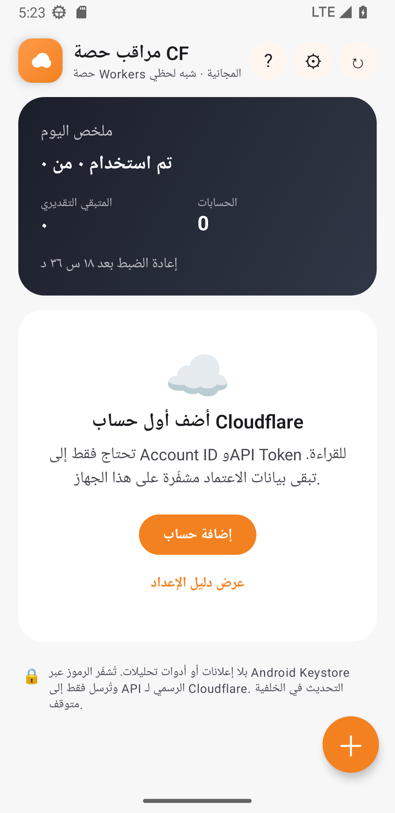

<a href="README.md">简体中文</a> · <a href="README_EN.md">English</a> · <a href="README_RU.md">Русский</a> · <a href="README_IT.md">Italiano</a> · <a href="README_FR.md">Français</a> · <a href="README_ES.md">Español</a> · <strong>العربية</strong>

# مراقب حصة CF

تطبيق جميل وآمن ومحلي بالكامل لمراقبة حصة Cloudflare Workers اليومية لعدة حسابات. متاح لنظامي Android وWindows.

## التنزيل

| الجهاز | الملف |
|---|---|
| Windows بمعالج Intel/AMD | `CF-Quota-Monitor-v1.0.2-Windows-x64-Setup.exe` |
| Windows ARM/Snapdragon | `CF-Quota-Monitor-v1.0.2-Windows-arm64-Setup.exe` |
| نسخة Windows محمولة | ملف `Portable.zip` المناسب |
| Android 8.0 أو أحدث | `CF-Quota-Monitor-v1.3.1.apk` |

حزم Windows غير موقعة حاليًا وقد يعرض SmartScreen تحذير «ناشر غير معروف». نزّلها فقط من [Releases](../../releases/latest) وتحقق من `SHA256SUMS-Windows.txt`.

## الميزات

- عدة حسابات وأشرطة تقدم في شاشة واحدة
- قفل اختياري: مصادقة Android أو Windows Hello ورمز PIN احتياطي
- سبع لغات وواجهة عربية كاملة من اليمين إلى اليسار
- تحديث اختياري في الخلفية؛ يستمر Windows في شريط النظام
- Android Keystore وDPAPI الخاص بمستخدم Windows الحالي
- بلا إعلانات أو تحليلات أو خادم خاص أو تخزين سحابي للرموز
- يصدّر Android وWindows الحسابات المحددة إلى ملف `.cfqm` مشفر بكلمة مرور ومتوافق بين النظامين

 &nbsp; 

## الإعداد

1. افتح [Cloudflare Dashboard](https://dash.cloudflare.com) ثم **Workers & Pages** وانسخ **Account ID** المكون من 32 حرفًا.
2. افتح **Profile → API Tokens → Create Custom Token**.
3. امنح فقط `Account → Account Analytics → Read`.
4. أضف Account ID وAPI Token في التطبيق.

لا تستخدم Global API Key ولا تنشر الرمز. تبقى البيانات على الجهاز وتذهب الطلبات مباشرة إلى `api.cloudflare.com`. المشروع مرخص وفق [MIT](LICENSE) ومستقل وغير تابع لـCloudflare, Inc.

