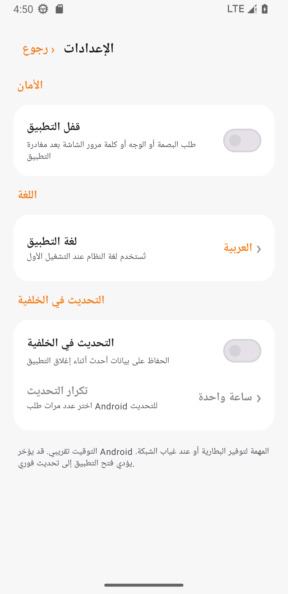

<a href="README.md">简体中文</a> · <a href="README_EN.md">English</a> · <a href="README_RU.md">Русский</a> · <a href="README_IT.md">Italiano</a> · <a href="README_FR.md">Français</a> · <a href="README_ES.md">Español</a> · <strong>العربية</strong>

# مراقب حصة CF v1.2

تطبيق Android جميل وآمن ومحلي بالكامل لمراقبة حصة Cloudflare Workers اليومية لعدة حسابات.

 &nbsp; 

## الميزات

- عدة حسابات وأشرطة تقدم في شاشة واحدة
- قفل اختياري بالبصمة أو الوجه أو بيانات اعتماد الجهاز؛ متوقف افتراضياً
- العربية والصينية والإنجليزية والروسية والإيطالية والفرنسية والإسبانية؛ اختيار أولي حسب لغة النظام
- تحديث اختياري في الخلفية كل 15/30 دقيقة أو 1/3/6/12/24 ساعة؛ متوقف افتراضياً
- تشفير API Token عبر AES-GCM وAndroid Keystore
- بلا إعلانات أو تحليلات أو خادم خاص أو نسخ سحابي

قد يؤخر Android مهام الخلفية لتوفير البطارية. يؤدي فتح التطبيق دائماً إلى تحديث فوري.

## التثبيت والإعداد

نزّل `CF额度监控-v1.2.0.apk` من [Releases](../../releases/latest). يتطلب Android 8.0 أو أحدث.

1. افتح [Cloudflare Dashboard](https://dash.cloudflare.com) ثم **Workers & Pages** وانسخ **Account ID** المكون من 32 حرفاً.
2. افتح **Profile → API Tokens → Create Custom Token**.
3. امنح فقط `Account → Account Analytics → Read` واقصر المورد على الحساب المراقب.
4. اضغط **＋** في التطبيق والصق Account ID وAPI Token.

لا تستخدم Global API Key ولا تنشر الرمز مطلقاً.

## الخصوصية والترخيص

تبقى الرموز والذاكرة المؤقتة على الجهاز، وتذهب الطلبات مباشرة إلى `api.cloudflare.com`. المشروع مرخص وفق [MIT](LICENSE) ومستقل وغير تابع لـ Cloudflare, Inc. قد تتأخر بيانات Analytics وليست عداد الفوترة الرسمي.

