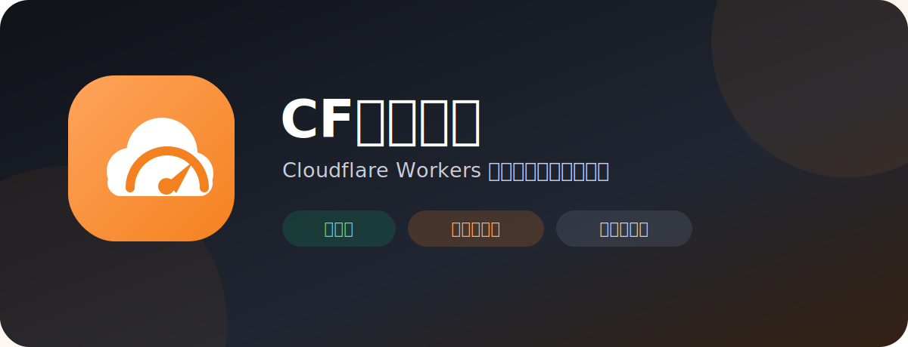
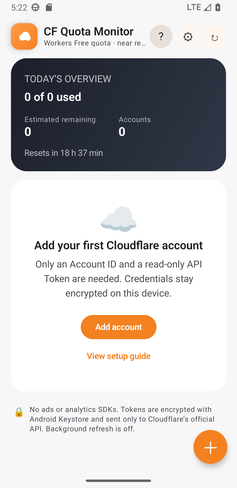
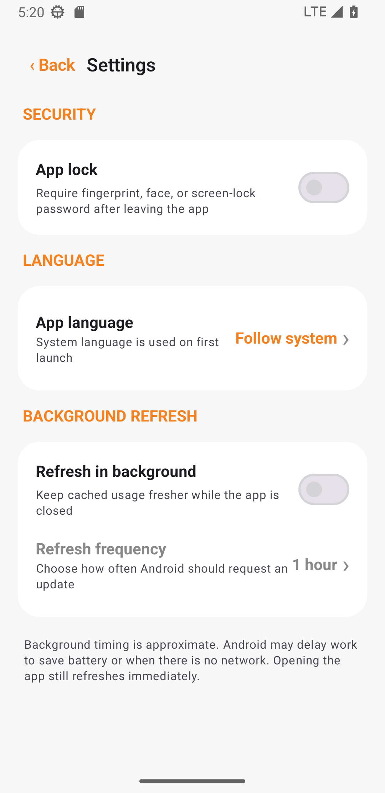

<a href="README.md">简体中文</a> · <strong>English</strong> · <a href="README_RU.md">Русский</a> · <a href="README_IT.md">Italiano</a> · <a href="README_FR.md">Français</a> · <a href="README_ES.md">Español</a> · <a href="README_AR.md">العربية</a>

# CF Quota Monitor

A beautiful, secure, local-first dashboard for monitoring daily Cloudflare Workers quota across multiple accounts. Available for Android and Windows.

## Download

| Device | File |
|---|---|
| Most Windows PCs with Intel/AMD | `CF-Quota-Monitor-v1.0.2-Windows-x64-Setup.exe` |
| Windows on ARM/Snapdragon | `CF-Quota-Monitor-v1.0.2-Windows-arm64-Setup.exe` |
| Portable Windows version | Matching `Portable.zip` |
| Android 8.0+ | `CF-Quota-Monitor-v1.3.1.apk` |

Windows packages are currently unsigned and may show a SmartScreen “unknown publisher” warning. Download only from this repository's [Releases](../../releases/latest) and verify `SHA256SUMS-Windows.txt`.

## Highlights

- Multiple accounts, progress bars, used and estimated remaining quota
- Optional app lock: device authentication on Android; Windows Hello or fallback PIN on Windows
- Chinese, English, Russian, Italian, French, Spanish, and Arabic with automatic system-language selection
- Optional background refresh; Windows continues while running in the system tray
- Android Keystore protection on Android and per-user Windows DPAPI protection on Windows
- No ads, analytics SDK, custom server, or cloud credential storage
- Android and Windows can export selected accounts to a password-protected `.cfqm` backup, import it across platforms, and choose how duplicates are handled

 &nbsp; 

## Three-minute setup

1. In [Cloudflare Dashboard](https://dash.cloudflare.com), open **Workers & Pages** and copy the 32-character **Account ID**.
2. Go to **Profile → API Tokens → Create Custom Token**.
3. Grant only `Account → Account Analytics → Read` and limit it to the monitored account.
4. Add the Account ID and API Token in the app.

Never use a Global API Key or publish a token in chat, issues, or GitHub.

## Privacy, security, and license

Tokens and cached usage stay on the device. Requests go directly to `api.cloudflare.com`. See [PRIVACY.md](PRIVACY.md), [SECURITY.md](SECURITY.md), and the [Windows guide](docs/Windows安装与使用.md).

Licensed under the [MIT License](LICENSE). This independent project is not affiliated with Cloudflare, Inc. Analytics data may lag and is not the official billing counter.
