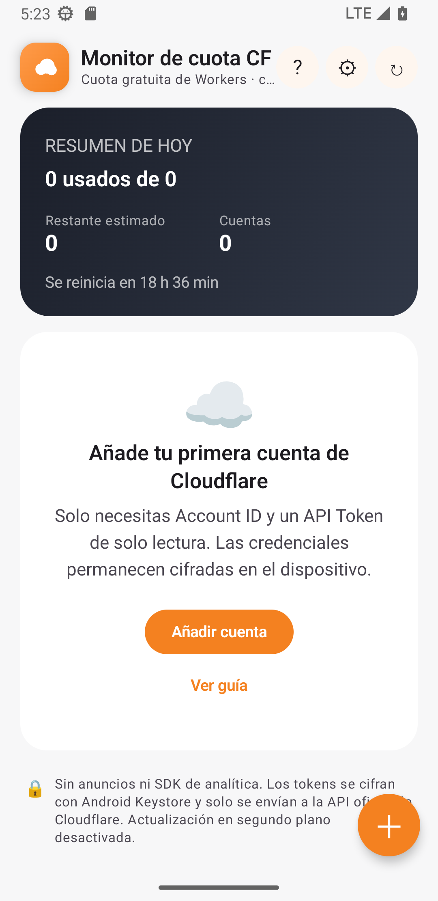
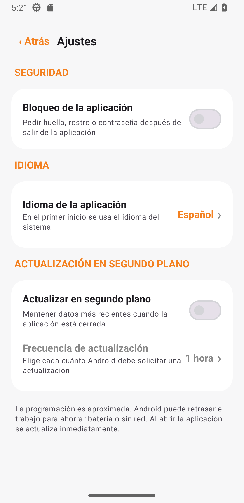

<a href="README.md">简体中文</a> · <a href="README_EN.md">English</a> · <a href="README_RU.md">Русский</a> · <a href="README_IT.md">Italiano</a> · <a href="README_FR.md">Français</a> · <strong>Español</strong> · <a href="README_AR.md">العربية</a>

# Monitor de cuota CF

Una aplicación atractiva, segura y totalmente local para controlar la cuota diaria de Cloudflare Workers en varias cuentas. Disponible para Android y Windows.

## Descarga

| Dispositivo | Archivo |
|---|---|
| Windows Intel/AMD | `CF-Quota-Monitor-v1.0.2-Windows-x64-Setup.exe` |
| Windows ARM/Snapdragon | `CF-Quota-Monitor-v1.0.2-Windows-arm64-Setup.exe` |
| Windows portátil | El `Portable.zip` correspondiente |
| Android 8.0+ | `CF-Quota-Monitor-v1.3.1.apk` |

Los paquetes Windows aún no están firmados y SmartScreen puede mostrar “editor desconocido”. Descárgalos solo desde [Releases](../../releases/latest) y verifica `SHA256SUMS-Windows.txt`.

## Funciones

- Varias cuentas y barras de progreso en una sola pantalla
- Bloqueo opcional: autenticación de Android o Windows Hello/PIN alternativo
- Siete idiomas, incluida interfaz árabe de derecha a izquierda
- Actualización opcional en segundo plano; Windows continúa en la bandeja
- Android Keystore y DPAPI del usuario actual de Windows
- Sin anuncios, analítica, servidor propio ni almacenamiento cloud de tokens
- Android y Windows exportan las cuentas seleccionadas a un archivo `.cfqm` cifrado con contraseña y compatible entre plataformas

 &nbsp; 

## Configuración

1. En [Cloudflare Dashboard](https://dash.cloudflare.com), abre **Workers & Pages** y copia el **Account ID** de 32 caracteres.
2. Abre **Profile → API Tokens → Create Custom Token**.
3. Concede solo `Account → Account Analytics → Read`.
4. Añade el Account ID y el API Token en la aplicación.

No uses una Global API Key ni publiques ningún token. Los datos permanecen en el dispositivo y las solicitudes van directamente a `api.cloudflare.com`. Licencia [MIT](LICENSE), proyecto independiente no afiliado a Cloudflare, Inc.
