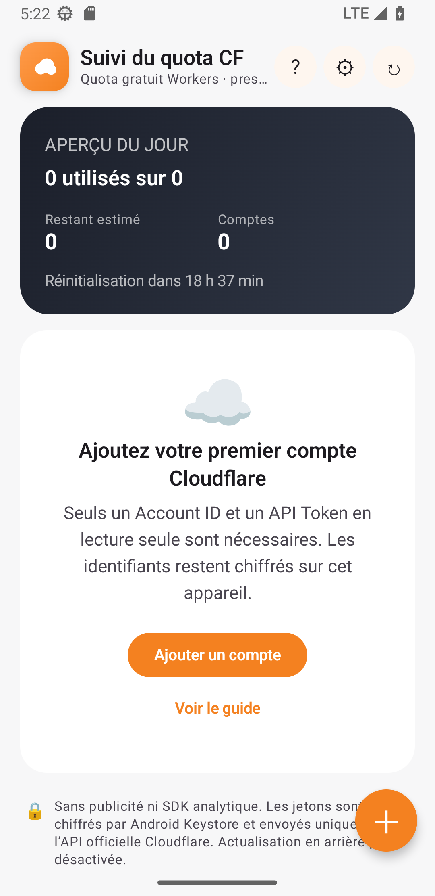
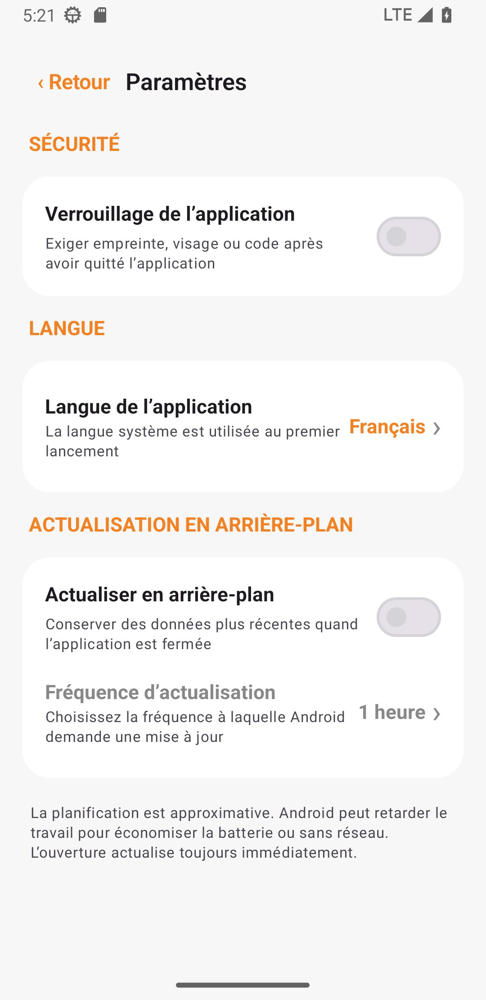

<a href="README.md">简体中文</a> · <a href="README_EN.md">English</a> · <a href="README_RU.md">Русский</a> · <a href="README_IT.md">Italiano</a> · <strong>Français</strong> · <a href="README_ES.md">Español</a> · <a href="README_AR.md">العربية</a>

# Suivi du quota CF

Une application belle, sûre et entièrement locale pour suivre le quota quotidien Cloudflare Workers de plusieurs comptes. Disponible pour Android et Windows.

## Téléchargement

| Appareil | Fichier |
|---|---|
| Windows Intel/AMD | `CF-Quota-Monitor-v1.0.2-Windows-x64-Setup.exe` |
| Windows ARM/Snapdragon | `CF-Quota-Monitor-v1.0.2-Windows-arm64-Setup.exe` |
| Windows portable | Le `Portable.zip` correspondant |
| Android 8.0+ | `CF-Quota-Monitor-v1.3.1.apk` |

Les paquets Windows ne sont pas encore signés et SmartScreen peut afficher « éditeur inconnu ». Téléchargez-les uniquement depuis [Releases](../../releases/latest) et vérifiez `SHA256SUMS-Windows.txt`.

## Fonctionnalités

- Plusieurs comptes et barres de progression sur le même écran
- Verrouillage facultatif : authentification Android ou Windows Hello/PIN de secours
- Sept langues, dont une interface arabe de droite à gauche
- Actualisation facultative en arrière-plan ; Windows continue dans la zone de notification
- Android Keystore et DPAPI de l'utilisateur Windows actuel
- Sans publicité, analytique, serveur propriétaire ni stockage cloud des jetons
- Android et Windows exportent les comptes sélectionnés dans un fichier `.cfqm` chiffré par mot de passe et compatible entre plateformes

 &nbsp; 

## Configuration

1. Dans [Cloudflare Dashboard](https://dash.cloudflare.com), ouvrez **Workers & Pages** et copiez l'**Account ID** de 32 caractères.
2. Ouvrez **Profile → API Tokens → Create Custom Token**.
3. Accordez uniquement `Account → Account Analytics → Read`.
4. Ajoutez l'Account ID et l'API Token dans l'application.

N'utilisez jamais de Global API Key et ne publiez pas de jeton. Les données restent sur l'appareil et les requêtes vont directement à `api.cloudflare.com`. Licence [MIT](LICENSE), projet indépendant non affilié à Cloudflare, Inc.
