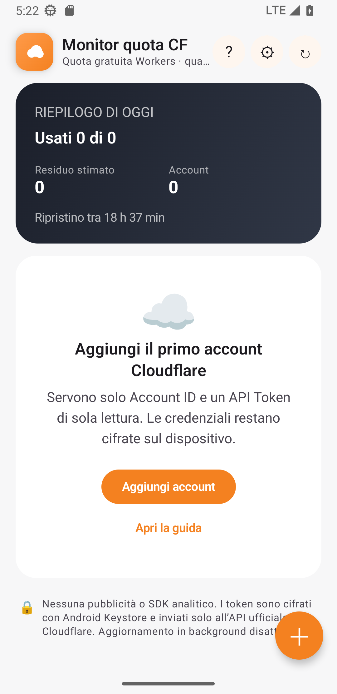
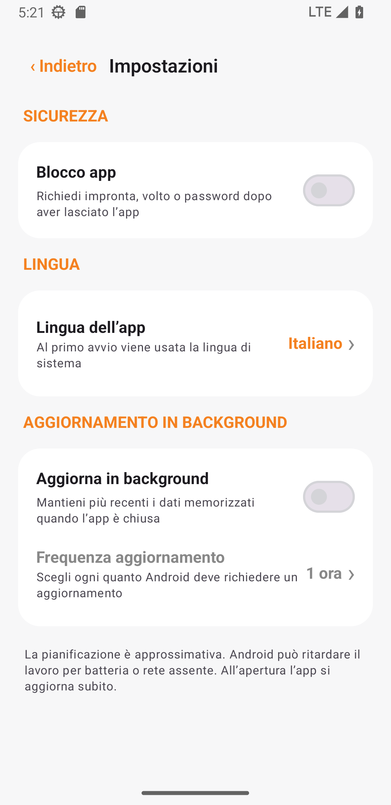

<a href="README.md">简体中文</a> · <a href="README_EN.md">English</a> · <a href="README_RU.md">Русский</a> · <strong>Italiano</strong> · <a href="README_FR.md">Français</a> · <a href="README_ES.md">Español</a> · <a href="README_AR.md">العربية</a>

# Monitor quota CF

Un'app bella, sicura e locale per controllare la quota giornaliera Cloudflare Workers di più account. Disponibile per Android e Windows.

## Download

| Dispositivo | File |
|---|---|
| Windows Intel/AMD | `CF-Quota-Monitor-v1.0.0-Windows-x64-Setup.exe` |
| Windows ARM/Snapdragon | `CF-Quota-Monitor-v1.0.0-Windows-arm64-Setup.exe` |
| Windows portatile | `Portable.zip` dell'architettura corretta |
| Android 8.0+ | `CF-Quota-Monitor-v1.3.0.apk` |

I pacchetti Windows non sono ancora firmati e SmartScreen può mostrare “editore sconosciuto”. Scaricali solo da [Releases](../../releases/latest) e verifica `SHA256SUMS-Windows.txt`.

## Funzioni

- Più account e barre di avanzamento nella stessa schermata
- Blocco facoltativo: credenziale Android o Windows Hello/PIN di riserva
- Sette lingue, inclusa l'interfaccia araba da destra a sinistra
- Aggiornamento in background facoltativo; Windows continua nell'area di notifica
- Android Keystore e DPAPI per l'utente Windows corrente
- Nessuna pubblicità, analisi, server proprietario o archiviazione cloud dei token
- Android e Windows esportano gli account selezionati in un backup `.cfqm` protetto da password e compatibile tra piattaforme

 &nbsp; 

## Configurazione

1. In [Cloudflare Dashboard](https://dash.cloudflare.com), apri **Workers & Pages** e copia l'**Account ID** di 32 caratteri.
2. Apri **Profile → API Tokens → Create Custom Token**.
3. Concedi solo `Account → Account Analytics → Read`.
4. Aggiungi Account ID e API Token nell'app.

Non usare una Global API Key e non pubblicare mai un token. Token e cache restano sul dispositivo; le richieste vanno direttamente a `api.cloudflare.com`. Licenza [MIT](LICENSE), progetto non affiliato a Cloudflare, Inc.
