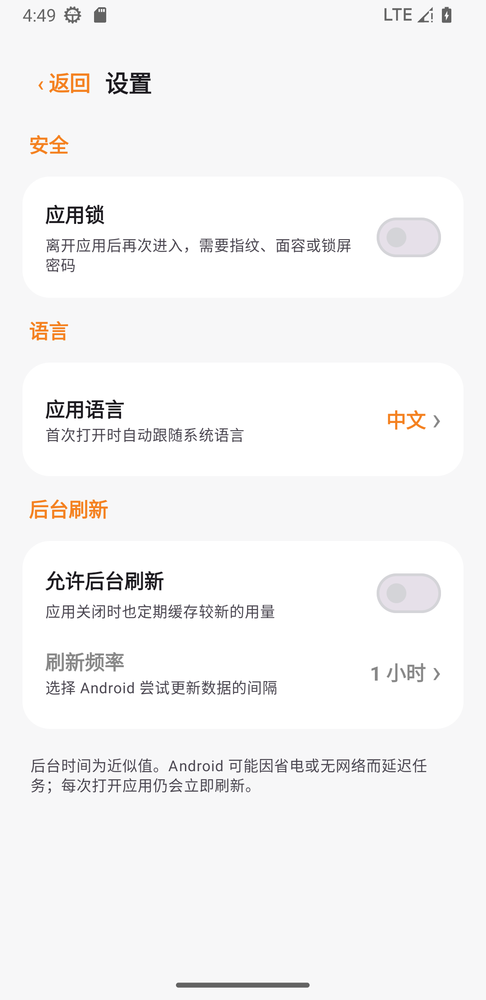

<a href="README.md">简体中文</a> · <a href="README_EN.md">English</a> · <strong>Русский</strong> · <a href="README_IT.md">Italiano</a> · <a href="README_FR.md">Français</a> · <a href="README_ES.md">Español</a> · <a href="README_AR.md">العربية</a>

# Монитор квоты CF v1.2

Красивое и безопасное локальное Android-приложение для контроля дневной квоты Cloudflare Workers в нескольких аккаунтах.

 &nbsp; 

## Возможности

- Несколько аккаунтов и индикаторов на одном экране
- Необязательная блокировка отпечатком, лицом или паролем устройства; по умолчанию выключена
- Русский, китайский, английский, итальянский, французский, испанский и арабский; при первом запуске язык выбирается по системе
- Необязательное фоновое обновление: 15/30 минут или 1/3/6/12/24 часа; по умолчанию выключено
- Шифрование API Token через AES-GCM и Android Keystore
- Без рекламы, аналитики, собственного сервера и облачного резервирования

Android может задерживать фоновые задачи для экономии батареи. При открытии данные обновляются сразу.

## Установка и настройка

Скачайте `CF额度监控-v1.2.0.apk` в [Releases](../../releases/latest). Требуется Android 8.0 или новее.

1. В [Cloudflare Dashboard](https://dash.cloudflare.com) откройте **Workers & Pages** и скопируйте 32-значный **Account ID**.
2. Откройте **Profile → API Tokens → Create Custom Token**.
3. Добавьте только `Account → Account Analytics → Read` и ограничьте ресурс нужным аккаунтом.
4. Нажмите **＋** в приложении и вставьте Account ID и API Token.

Не используйте Global API Key и не публикуйте токены.

## Конфиденциальность и лицензия

Токены и кэш остаются на устройстве, запросы отправляются прямо на `api.cloudflare.com`. Проект распространяется по [MIT License](LICENSE), не связан с Cloudflare, Inc. Данные Analytics могут запаздывать и не являются официальным счётчиком оплаты.
