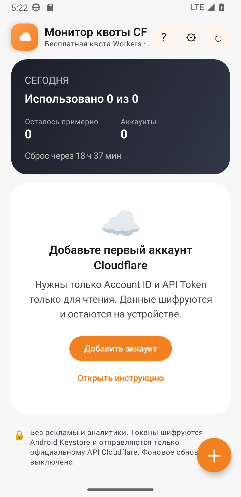
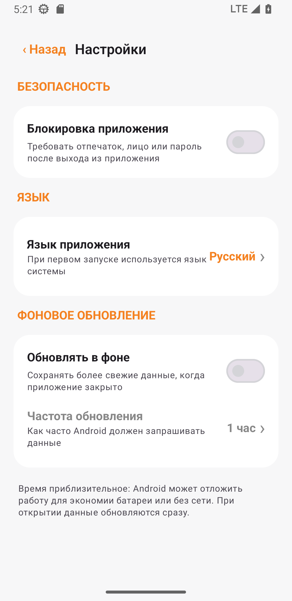

<a href="README.md">简体中文</a> · <a href="README_EN.md">English</a> · <strong>Русский</strong> · <a href="README_IT.md">Italiano</a> · <a href="README_FR.md">Français</a> · <a href="README_ES.md">Español</a> · <a href="README_AR.md">العربية</a>

# Монитор квоты CF

Красивое, безопасное и полностью локальное приложение для контроля дневной квоты Cloudflare Workers в нескольких аккаунтах. Доступно для Android и Windows.

## Загрузка

| Устройство | Файл |
|---|---|
| Windows с Intel/AMD | `CF-Quota-Monitor-v1.0.0-Windows-x64-Setup.exe` |
| Windows ARM/Snapdragon | `CF-Quota-Monitor-v1.0.0-Windows-arm64-Setup.exe` |
| Портативная версия Windows | Соответствующий `Portable.zip` |
| Android 8.0+ | `CF-Quota-Monitor-v1.2.0.apk` |

Пакеты Windows пока не подписаны и могут вызвать предупреждение SmartScreen. Загружайте их только из [Releases](../../releases/latest) и сверяйте `SHA256SUMS-Windows.txt`.

## Возможности

- Несколько аккаунтов и индикаторов на одном экране
- Необязательная блокировка: системная проверка Android или Windows Hello/резервный PIN
- Русский, китайский, английский, итальянский, французский, испанский и арабский
- Необязательное фоновое обновление; в Windows приложение работает в области уведомлений
- Android Keystore и шифрование DPAPI текущего пользователя Windows
- Без рекламы, аналитики, собственного сервера и облачного хранения токенов
- Windows экспортирует выбранные аккаунты в защищённый паролем файл `.cfqm`

Android v1.2 пока не импортирует `.cfqm`; поддержка появится в следующей мобильной версии.

 &nbsp; 

## Настройка

1. В [Cloudflare Dashboard](https://dash.cloudflare.com) откройте **Workers & Pages** и скопируйте 32-значный **Account ID**.
2. Откройте **Profile → API Tokens → Create Custom Token**.
3. Добавьте только `Account → Account Analytics → Read` и ограничьте ресурс нужным аккаунтом.
4. Добавьте Account ID и API Token в приложении.

Не используйте Global API Key и не публикуйте токены. Данные остаются на устройстве, запросы идут прямо на `api.cloudflare.com`. Проект распространяется по [MIT License](LICENSE), не связан с Cloudflare, Inc.
